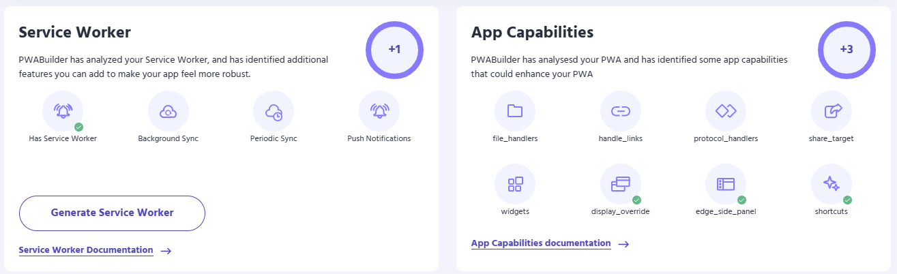
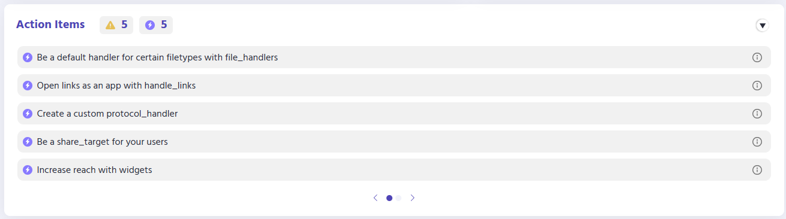

To increase discoverability and education surrounding the features that developers can take advantage of to make their apps feel more native, the PWABuilder team is introducing the brand new “App Capabilities” card. From customizing the physical appearance of the installed PWA with display_override to telling the PWA how to handle incoming files and links with file_handlers and handle_links respectively, implementing these capabilities can help a PWA embrace the “progressive” part of its name.

    </img>
    </img>

On hover, each of the bubbles will show a tooltip that has a brief description of the field, links to read more, and a link to edit the field directly in the Manifest Editor if PWABuilder currently supports the field. For the fields that are not supported, they will be getting added in the months to come. 

</img>

This update also changed the way users can interact with their Action Items. The indicator pills that live above the list are now clickable and filter the list to match the selected filter. Red filters required fields that block packaging, yellow indicates recommended or optional fields, and the new purple lightning bolt tells the user how many app capabilities they have left to potentially add to their PWA. 

Visit [pwabuilder.com](https://www.pwabuilder.com) to check out the new App Capabilities card now!