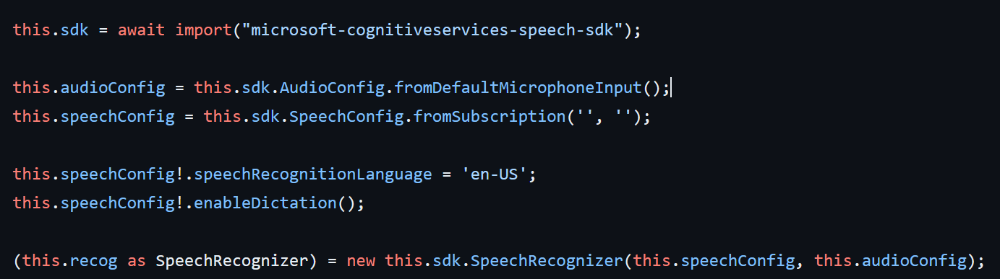
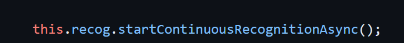

Hello! I recently released an app I've been working on, Memos AI, and I wanted to talk a bit about how I built this app. Before we dive in, let’s touch on exactly what Memos AI is. Memos AI is a voice memos app that uses artificial intelligence to automatically take notes for you during lectures, meetings etc. Memos AI will:

* Transcribe speech
* Summarize that transcription
* Take notes based on that transcript
* and more!

Now, let's dive into how I did AI on the web!

First, a quick demo:

## AI on the Web 

On my journey of building this app, I evaluated the exiting AI solutions that are available for web apps. I was happily surprised to see multiple open-source options for running AI inference client-side! This, when combined with things like the OpenAI API or Azure for more compute heavy issues, can come together to provide high-quality AI experiences in a PWA. 

For Memos AI, the main AI feature is speech-to-text. I wanted to go with a "cloud by default" approach for the best performance across all devices, but with the option for a user to run the AI features client side, on their own device. This ensures that users on mobile devices or less powerful devices overall are not left out of the experience.

### Live Speech-To-Text

#### In the Cloud
For the live speech-to-text transcript, I am using the [Azure Speech SDK](https://learn.microsoft.com/en-us/azure/ai-services/speech-service/speech-sdk) which supports JavaScript both in the browser and in Node. The Azure Speech SDK supports [live client-side speech-to-text](https://learn.microsoft.com/en-us/azure/ai-services/speech-service/how-to-recognize-speech?pivots=programming-language-javascript#recognize-speech-from-a-microphone), in the browser, using the users mic on their device. This made it incredibly easy to implement in my app with just some JavaScript:

This code sets up a `Speech Recognizer`, that I can then use to run live client-side speech-to-text by calling the `startContinuousRecognitionAsync` method. 

This works perfectly in my web components based app as its just standard JavaScript that would work in any framework.

#### Client-Side
As mentioned above, I found existing solutions for running AI inference client-side in a web app, including the [transformers.js](https://github.com/xenova/transformers.js/) which enables the ability to run AI models from HuggingFace client-side in your browser!

While it is possible, I did not set this up to do live speech-to-text, but instead to run on a recorded blob from the note, which I generated with the [MediaRecorder API](https://developer.mozilla.org/en-US/docs/Web/API/MediaRecorder). I then pass this blob to a Web Worker (so as not to block the UI while it is transcribing), which then does local speech-to-text using the following code:

 
As I mentioned, this code is running in a [web worker](https://developer.mozilla.org/en-US/docs/Web/API/Web_Workers_API/Using_web_workers), which is a built-in way to run code on a different thread than the main UI thread. This ensures that our UI stays responsive while doing heavy work in a worker thread.

And that is how I implemented AI in Memos AI! For the rest of the app, I used our [PWA Starter](https://aka.ms/pwa-starter), with the [Fluent Web Components](https://learn.microsoft.com/en-us/fluent-ui/web-components/) for the UI. For animations between pages, I am using the built-in [View Transitions API](https://developer.mozilla.org/en-US/docs/Web/API/View_Transitions_API) which enables native, built-in animated page transitions. I am not going to dive into detail on this today, but check out our latest post on the view transitions API [here](https://blog.pwabuilder.com/posts/mimic-native-transitions-in-your-progressive-web-app/) for more detail.

 Thanks!