# Creating an Apple key

To let your users sign-in with their Apple account, you'll need to create an Apple key. This walk-through shows how to do that. You may also refer to Apple's own [Sign in with Apple developer overview](https://developer.apple.com/sign-in-with-apple/) and [Sign in with Apple configuration docs](https://help.apple.com/developer-account/?lang=en#/dev1c0e25352).

In short, we'll go to the Apple Developer portal, create an App ID, create a Service ID, and create a private key.

Before we get started, a few disclosures:

- **It's not free**. Creating an Apple key requires a membership in Apple's Developer Program, which costs $99/year for individuals and businesses; free for non-profits.
- **You won't get a profile pic**. An Apple key doesn't let you get the user's profile picture; when `signin-completed` event fires, `imageUrl` will be null.
- **Subsequent sign-ins won't include the user's full name** - Apple's flow is such that you'll receive the user's full name only the first time they sign-in. It's your responsibility to save the user's full name the first time he or she signs-in.
- **You may or may not receive the user's real email address** When a user tries to sign in with their Apple account, the user is presented with a prompt, *"Do you want to share your email address with XYZ App?"* If the user declines, your app will instead receive an Apple-proxied email address which users can disable later. See [Apple email relay](#apples-email-relay-service) for more details.

If none of that scares you off, read on.

## Step 1: Sign in to the <a href="https://developer.apple.com/account">Apple Developer Portal</a>

Go to the <a href="https://developer.apple.com/account">Apple Developer portal</a> and sign-in with your Apple account. 

If you're not already a member of Apple's Developer Program, you'll be prompted to [enroll](https://developer.apple.com/programs/enroll/). The cost of enrollment is $99 USD/year, which gives you access to Apple's developer APIs and ability to publish to the iOS and MacOS app stores.

## Step 2: Create an App ID

Once you're signed-in, go to `Certificates, Identifiers & Profiles`:

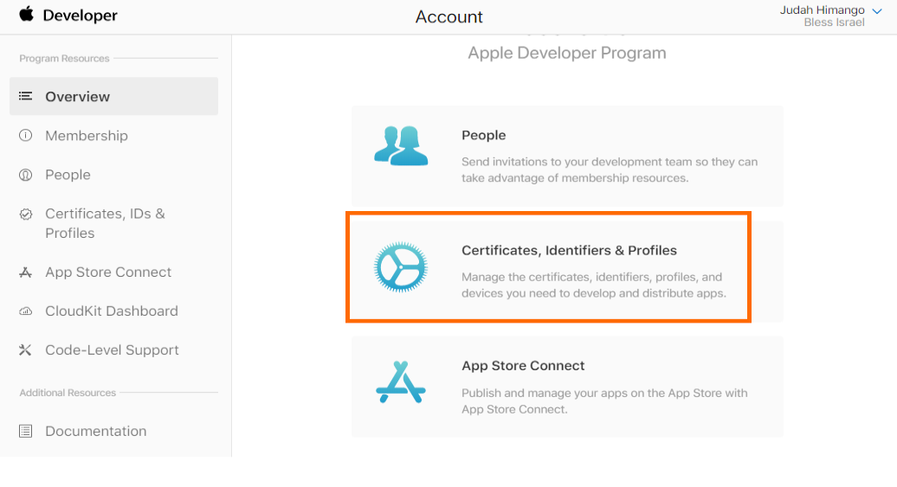

Then choose `Identifiers`, and click the `+` button to add a new ID:

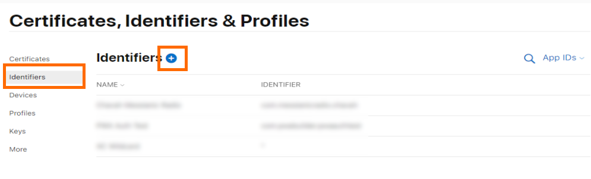

You'll be prompted to choose a type of ID:

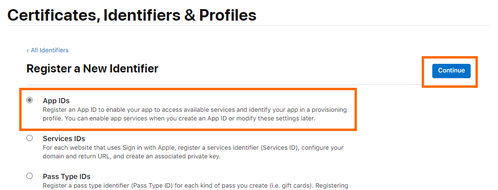

Choose `App IDs` and click `Continue`.

You're now prompted for app description, app ID, and app capabilities:

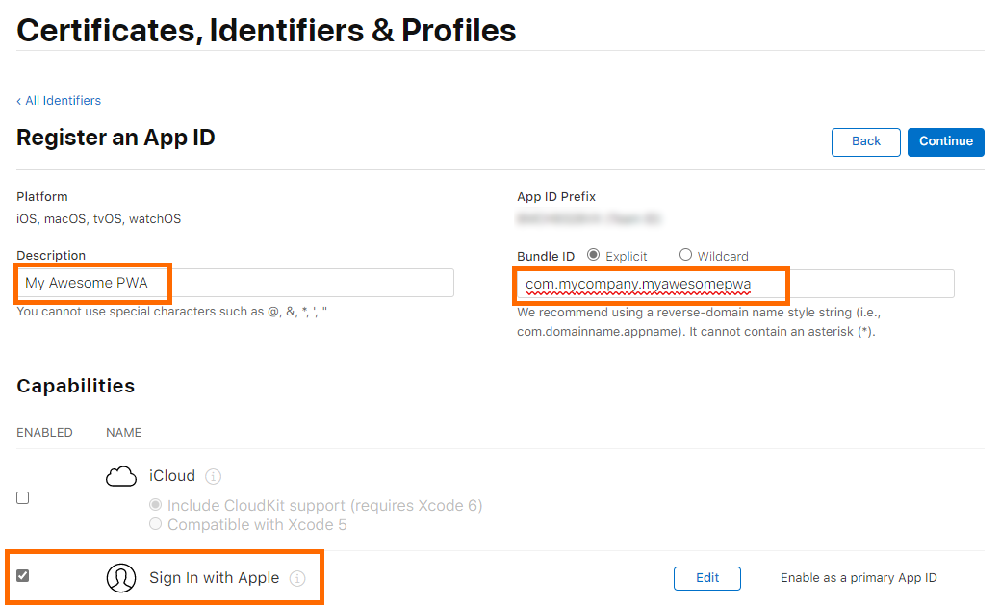

Fill in the values as you see fit. Be sure to check the `Sign in with Apple` capability.

Click `Continue` to proceed to the final review page. Then click `Register` to finish creating the App ID.

## Step 3: Create a `Service ID`

Now that we have an App ID, Apple requires you to create a Service ID for web authentication.

Back on the `Services, Identifiers & Profiles` page, create another ID:


You're prompted for the type of ID. This time, choose `Services IDs`:

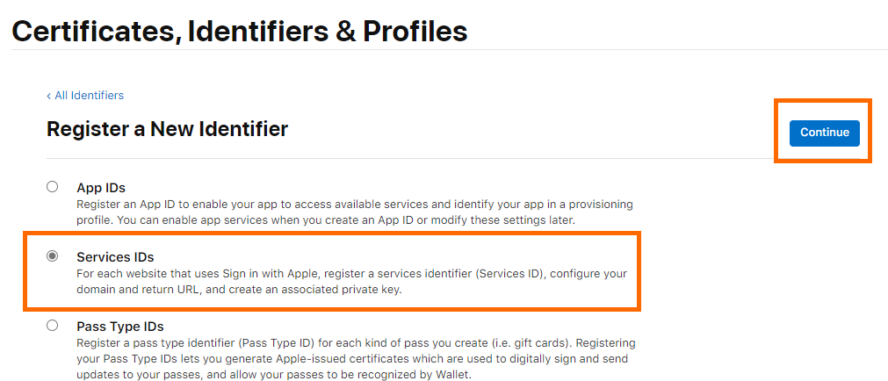

Click continue. You'll prompted for a description of the service and identifier:

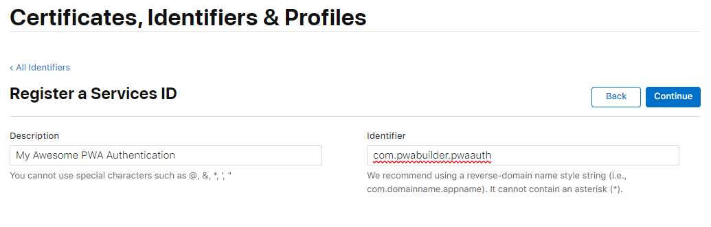

- **Description**: The user-facing name of your app. Users will see this when they try to sign-in to your app with their Apple account.
- **Identifier**: The ID of the Service. This will be the key we use in the pwa-auth component.

Click `Continue` to move to the final review page, then click `Register` to finish creating your Service ID.

## Step 4: Configure Service ID for your web app

Back on the `Services, Identifiers & Profiles` page, on the top right, change the filter to `Service IDs`, then choose the Service ID you just created:

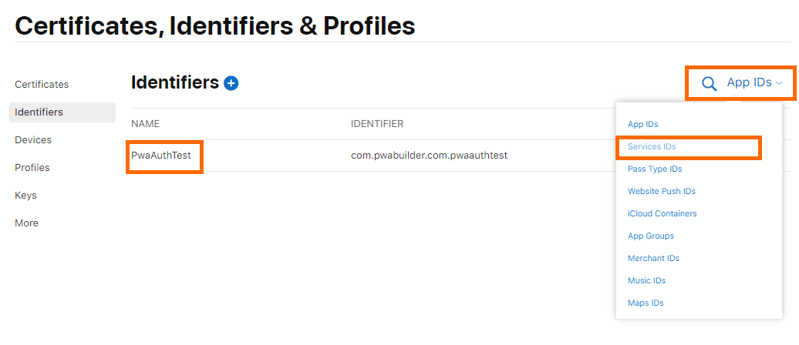

You'll be prompted to edit your service config:

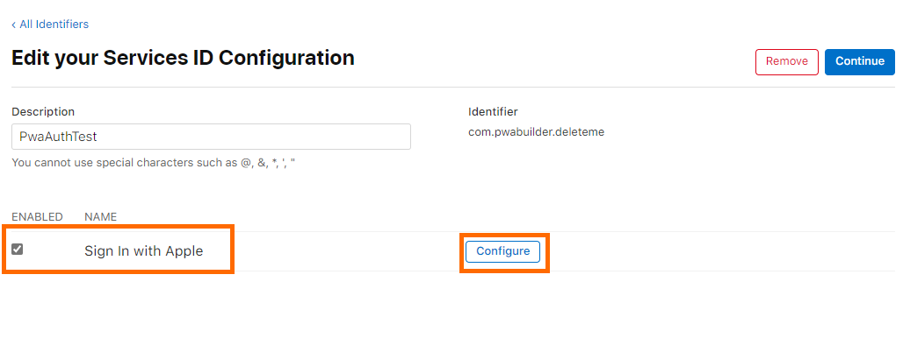

Above: Enable `Sign in with Apple` then click `Configure`, which will launch the configuration page.

On the configuration page, you're prompted for domains and Return URLs:

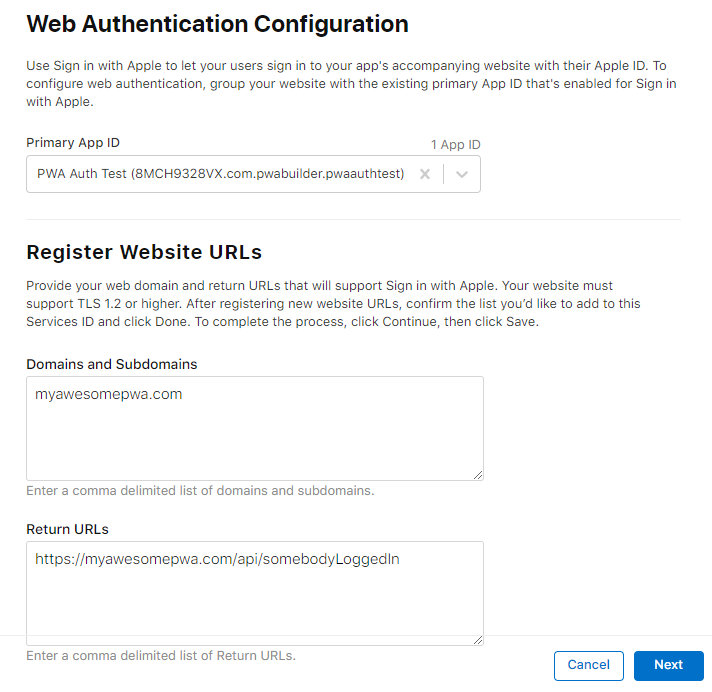

**Domains**: These are the domains where you're using Sign in with Apple. This should be the domain of your PWA.

**Return URLs** These are the URLs where Apple will POST to your backend. If you're not using a backend, you can just use your domain URL here.

> 👀 Danger, Will Robinson!
> 
> **Domains and Subdomains** must *not* have `http://` or `https://`; it must be the bare domain (e.g. myawesomepwa.com), otherwise you'll get a validation error.
> 
> **Return URLs**, on the other hand, *must* have https:// included (e.g. https://myawesomepwa.com), otherwise users will receive an `invalid redirect_uri` error when trying to sign-in.

Once you've added a `Domain` and a `Return URL`, click `Next`, then click `Done`. 

You'll be back on the configuration screen. Click `Continue`, then click `Save` to finish configuration.

## Step 5: Create a private key

Apple requires you to create a private key associated with your App ID.

Back on the `Certificates, Identifiers & Profiles` page, choose `Keys`, then click the `+` button.

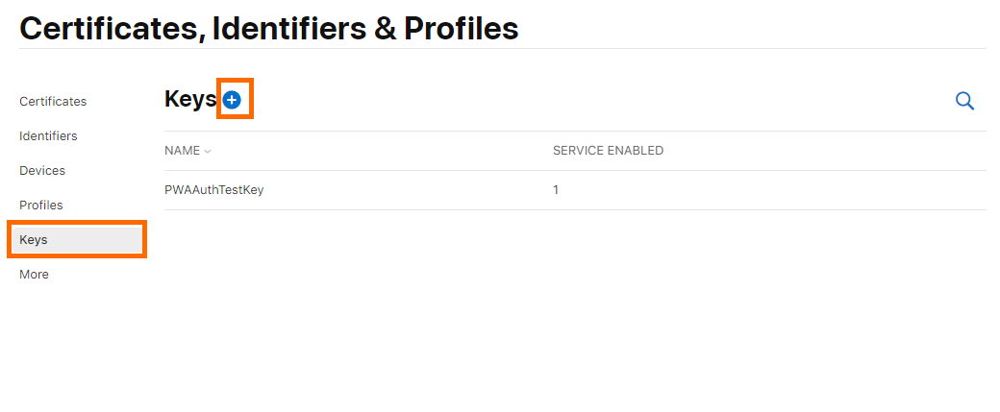

You'll be prompted to enter details for the new key.

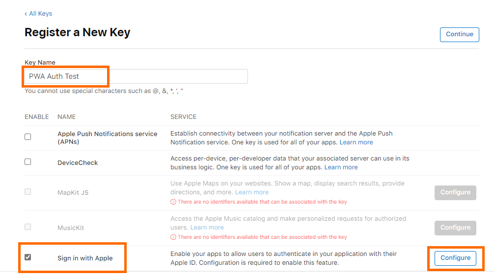

Above: Enter a name for your key, check `Sign in with Apple`, then click `Configure`.

This will bring up the key configuration screen. In the `Primary App ID` field, choose the App ID you created earlier:

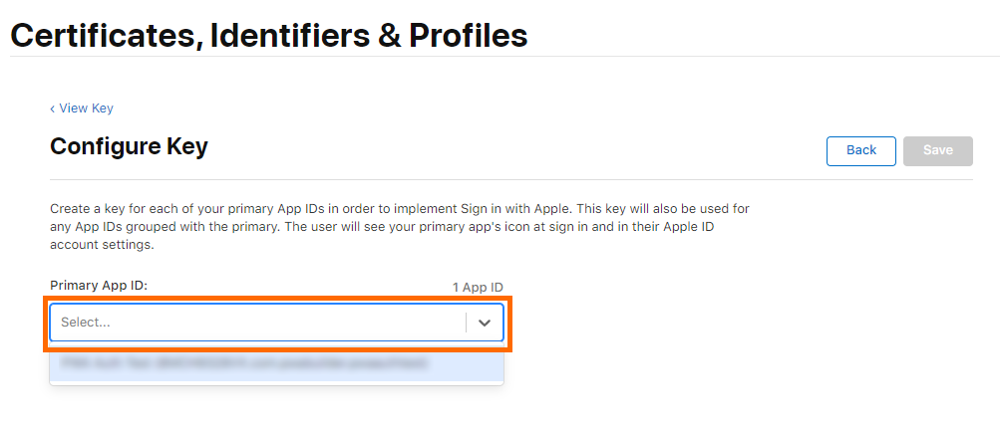

Click `Save`, then click `Continue`, then click `Register` to finalize the key.

You'll be prompted to download your key, with a notice that it can only be downloaded once, after which it will be deleted from Apple's servers.

You may optionally `Download` the key, then click `Done`.

## Step 6: Copy your Service bundle ID
Now that you have an App ID, Service ID, and private key, it's ready to be used in pwa-auth.

On the `Certificates, Identifiers & Profiles` page, choose `Identifiers`, filter to `Services IDs`, and choose the `Service ID` you created earlier.

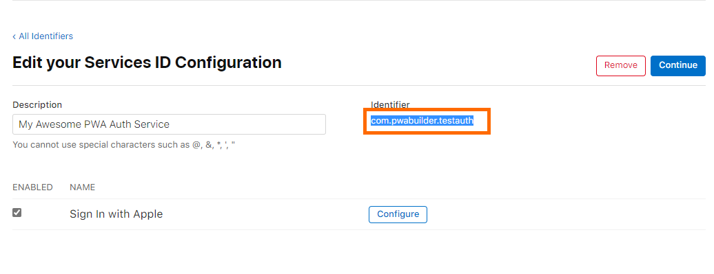

Copy `Identifier` and paste it into your `<pwa-auth>` component:

```html
<pwa-auth applekey="com.mycompany.myapp"></pwa-auth>
```

You're done - you now have a working Apple key, allowing users to sign-in with their Apple account. 😎

## Additional notes about Apple Sign In

### Overriding the redirect URI
By default, pwa-auth uses location.href to supply Apple's Sign In with the redirect_uri. This URI should correspond to one of the `Return URLs` you specified earlier when [configuring your Service ID](#Step-4-Configure-Service-ID-for-your-web-app). 

If location.href doesn't match up with one of your `Return URLs`, you'll get an `invalid redirect_uri` error when trying to sign-in with your Apple account.

Instead of using location.href, you can manually specify the redirect URI via the `appleredirecturi` attribute:

```html
<pwa-auth
    appleredirecturi="https://someotheruri.com/api/signin"
    applekey="com.mycompany.myapp">
</pwa-auth>
```

You may wish to specify this redirect so your backend can be notified when a user signs-in with their Apple account.

### Apple's email relay service
When a user signs-in to your app with their Apple account for the first time, Apple OAuth dialog will ask the user if they wish to share their email with your app:

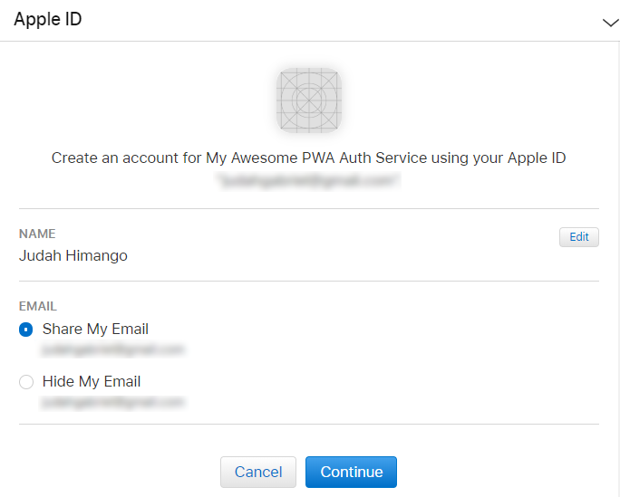

If the user chooses `Share My Email`, your app will receive the user's email.

But if the user chooses `Hide My Email`, your app will receive a proxy email address created by Apple's email relay service. If you wish to communicate with such users, you'll need to configure this on the `Certificates, Identifiers & Profiles` page:


There, you can register email sources that your app will use to contact users who choose to hide their email address.

### Apple JS / AppleID

pwa-auth uses [Apple JS](https://developer.apple.com/documentation/sign_in_with_apple/sign_in_with_apple_js) to allow users to sign-in with their Apple accounts.

 To keep pwa-auth lightweight, Apple JS is lazy loaded when a user taps `Sign in with Apple`. If a user doesn't try to sign-in with Apple, no JS loading or parsing overhead is incurred.

### Raw `providerData` with Apple Sign-In

When a user signs-in with their Apple account, pwa-auth will dispatch the `signin-completed` event. This event will contain the standard information -- `email`, `name` (on first login only), `imageUrl` (which will be null) -- as well as additional Apple-specific information contained in `providerData`:

```javascript
const pwaAuth = document.querySelector("pwa-auth");
pwaAuth.addEventListener("signin-completed", ev => {
    const signIn = ev.detail;
    if (!signIn.error) {
        console.log("Signed in with", signIn.email, signIn.name, signIn.imageUrl);

        // Access the raw Apple sign-in data:
        console.log("Raw data from Apple sign-in: ", signIn.providerData);
    }
});
```

`providerData` will generally look like this:

```JSON
{
    "authorization": {
        "code": "c747bc123abc",
        "id_token": "eyJraWQiabc.eyJpc123-abc-123"
    }
}
```
Basically, you'll receive a `code` and a `id_token`.

- `code` is an authorization code and can be used to [validate a sign-in](https://developer.apple.com/documentation/sign_in_with_apple/sign_in_with_apple_rest_api/verifying_a_user), obtain a refresh token, and more. You can validate tokens by POSTing to the [Apple Token Validation endpoint](https://developer.apple.com/documentation/sign_in_with_apple/generate_and_validate_tokens).

- `id_token` is an encoded [JSON Web Token (JWT)](https://jwt.io/), which can be decoded in JS or on your backend. Decoding it will give you a JSON object that looks something like:

```json
{
  "iss": "https://appleid.apple.com",
  "aud": "com.mycompany.myapp",
  "exp": 1587588358,
  "iat": 1587587758,
  "sub": "001242.aaa3e174cb4840e99d1dbe4770c3ba4a.2035",
  "c_hash": "HO6wlazihpWHRYE6imMbMQ",
  "email": "johndoe@icloud.com",
  "email_verified": "true",
  "auth_time": 1587587758,
  "nonce_supported": true
}
```
