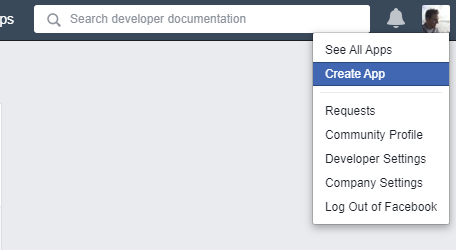
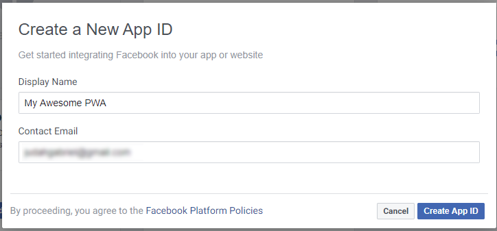
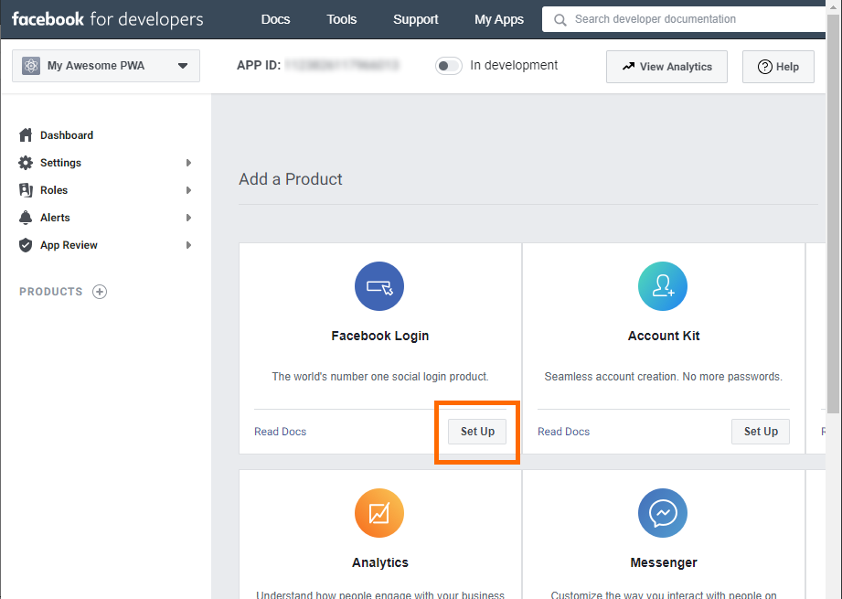
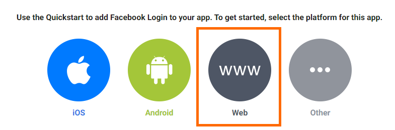
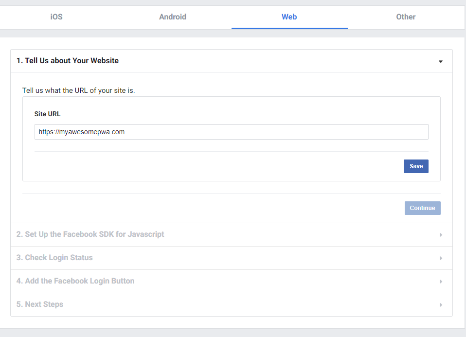
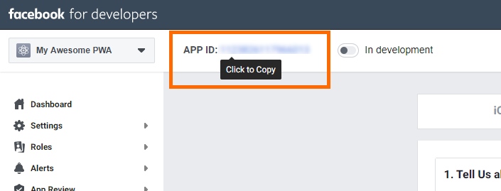

# Creating a Facebook key

To let your users sign-in with their Facebook account, you'll need to create a Facebook key. This walk-through shows how to do that. You may also refer to Facebook's documentation: [Register a Facebook App](https://developers.facebook.com/docs/apps#register).

In short, we'll go to the Facebook Developer portal, create a new Facebook App, configure it to allow Facebook Sign In, and grab the key.

## Step 1: Login to <a href="https://developers.facebook.com/">Facebook Developer portal</a>

Go to the <a href="https://developers.facebook.com/">Facebook Developer portal</a> and sign-in with your Facebook account.

## Step 2: Create a new App

In the top nav menu, hover over your profile picture, then choose `Create App`

(Alternately, `My Apps` -> `Create App`)



Creating a new project will prompt you to enter the app display name:



Click `Create App ID` to finish creating your project.

## Step 3: Add Facebook Login

After creating the new Facebook App, you're taken to the app's dashboard. From here, you'll see a list of Products you can add to your App. Find the `Facebook Login` product and click `Set Up`:



You'll be prompted for the type of app to create. Choose `Web`:



## Step 4: Configure Web Login

You're prompted for details about your PWA.



`Site URL` - Input your PWA URL

You can skip the other steps in the wizard, as pwa-auth already does them (e.g. loading the Facebook SDK).

## Step 5: Copy your key

Your Facebook App is now ready to be used for Facebook Sign In. At the top of the page is your `APP ID` - this is your key. Click it to copy:



Copy `APP ID` and paste it into your `<pwa-auth>` component:

```html
<pwa-auth facebookkey="abc123"></pwa-auth>
```

You're done - you now have a working Facebook key, allowing users to sign-in with their Facebook account. 😎

## Additional notes about the Facebook sign-in provider

### Facebook SDK

pwa-auth uses the Facebook SDK v6.0 to do sign-ins.

 To keep pwa-auth lightweight, the Facebook SDK is lazy loaded when a user taps `Sign in with Facebook`. If a user doesn't try to sign-in with Facebook, no JS loading or parsing overhead is incurred.

### Raw `providerData` with Facebook Sign-In

When a user signs-in with their Facebook account, pwa-auth will dispatch the `signin-completed` event. This event will contain the standard information -- `email`, `name`, `imageUrl`, `accessToken`, and `accessTokenExpiration` -- as well as additional Facebook-specific information contained in `providerData`:

```javascript
const pwaAuth = document.querySelector("pwa-auth");
pwaAuth.addEventListener("signin-completed", ev => {
    const signIn = ev.detail;
    if (!signIn.error) {
        console.log("Signed in with", signIn.email, signIn.name, signIn.imageUrl);

        // Access the raw Facebook sign-in data:
        console.log("Raw data from Facebook sign-in: ", signIn.providerData);
    }
});
```

`providerData` will generally look like this:

```JSON
{
    "user": {
        "id": "123",
        "name": "John Doe",
        "email": "johndoe@sample.com",
        "picture": {
            "data": {
                "height": 960,
                "is_silhouette": false,
                "url": "https://platform-lookaside.fbsbx.com/platform/profilepic/?asid=abc123&height=1440&width=1440&ext=abc123&hash=abc123",
                "width": 958
            }
        }
    },
    "auth": {
        "accessToken": "abc123",
        "userID": "123456",
        "expiresIn": 1234,
        "signedRequest": "abc123-xyz456",
        "graphDomain": "facebook",
        "data_access_expiration_time": 1234
    }
}
```

### Largest image returned
During sign-in, pwa-auth requests a 1440x1440 sized image for the user's profile, the largest permitted at the time of this writing. Facebook will return the user's profile picture in the size nearest these dimensions.

### Interacting with the Facebook Graph
Once a user has signed-in with Facebook, `window.FB` will be available to you to get additional user information from the Facebook Graph.