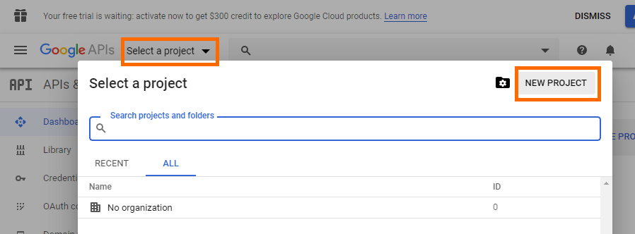
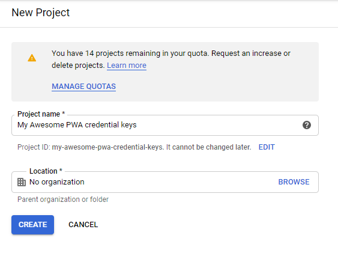
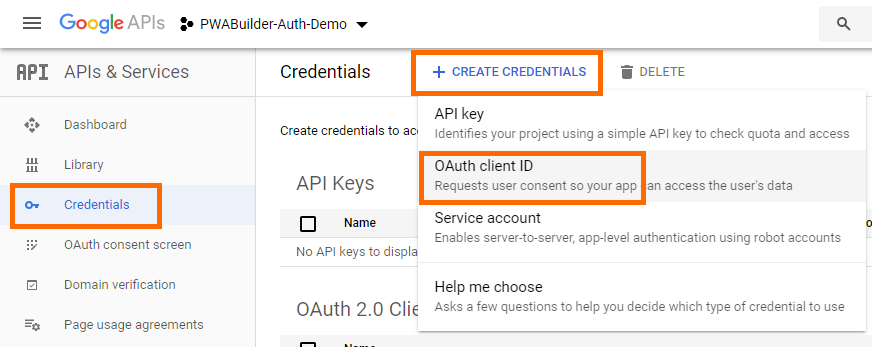
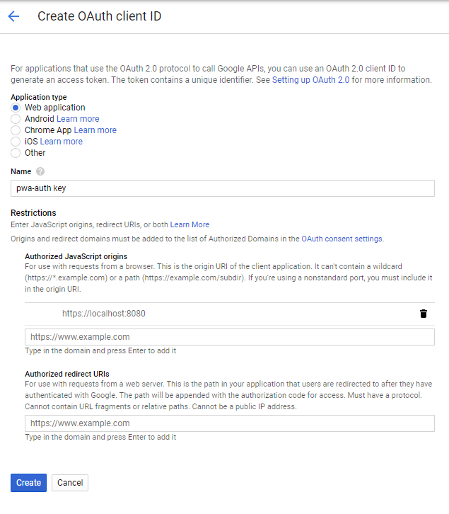
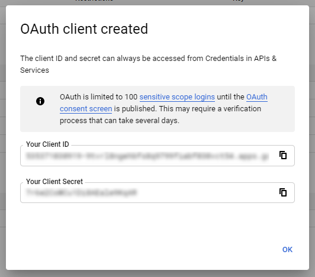

# Creating a Google key

To let your users sign-in with their Google account, you'll need to create a Google key. This walk-through shows how to do that. You may also refer to Google's documentation: [Configure a project for Google Sign-In with Google Developer Console](https://developers.google.com/identity/sign-in/web/sign-in#before_you_begin).

In short, we'll use Google Developer Console to create a Project, and within that project, create a credential (a key). 

## Step 1: Login to <a href="https://console.developers.google.com/">Google Developer Console</a>

Go to the <a href="https://console.developers.google.com/">Google Developer Console</a> and sign-in with your Google account.

## Step 2: Create a new Project

In the Developer Console, choose `Select a project` then click `New Project`.



Creating a new project will prompt you to enter the `Project name`. This is the name of the project in Google Developer Console, not the name displayed to end-users. 



Click `Create` to finish creating your project.

## Step 3: Create a credential

On the left navigation pane, choose `Credentials`. Click `+ Create Credentials` and from the dropdown menu, choose `OAuth client ID`.



## Step 4: Configure the credential for web sign-in

Google Developer Console will prompt you for the type of application you're using. Choose `Web application`.

This will open up additional configuration options: `Name`, `Authorized JavaScript origins`, and `Authorized redirect URIs`.



- `Name` - This is the name of the credential in Google Developer Console. (Not the name of your app.) You may use `pwa-auth key` or something similar.
- `Authorized JavaScript origins` - The URLs of your PWA where you're using the pwa-auth component. You may add your local development URL now (e.g. https://localhost:8080) for testing. You may add your production URLs later.
- `Authorized redirect URIs` - For use with requests from a web server. You may leave this empty for now.

Click `Create` to finalize your credential.

## Step 5: Copy your key

After creating your credential, you'll see you new dialog containing your credential ID and secret:



Copy `Your Client ID` and paste it into your `<pwa-auth>` component:

```html
<pwa-auth googlekey="abc123"></pwa-auth>
```

You're done - you now have a working Google key, allowing users to sign-in with their Google accounts. 😎

## Additional notes about the Google sign-in provider

### Google Platform library (GApi)

pwa-auth uses the Google Platform library (GApi) with `auth2` to sign-in with Google.

 To keep pwa-auth lightweight, GApi is lazy loaded when a user taps `Sign in with Google`. If a user doesn't try to sign-in with Google, no JS loading or parsing overhead is incurred.

### Raw `providerData` with Google Sign-In

When a user signs-in with their Google account, pwa-auth will dispatch the `signin-completed` event. This event will contain the standard information -- `email`, `name`, `imageUrl`, `accessToken`, `accessTokenExpiration` -- as well as additional Google-specific information contained in `providerData`:

```javascript
const pwaAuth = document.querySelector("pwa-auth");
pwaAuth.addEventListener("signin-completed", ev => {
    const signIn = ev.detail;
    if (!signIn.error) {
        console.log("Signed in with", signIn.email, signIn.name, signIn.imageUrl);

        // Access the raw Google sign-in data:
        console.log("Raw data from Google sign-in: ", signIn.providerData);
    }
});
```

`providerData` will generally look like this:

```JSON
{
    "Ca": "123456",
    "tc": {
        "token_type": "Bearer",
        "access_token": "ya29.abc123",
        "scope": "email profile https://www.googleapis.com/auth/userinfo.email https://www.googleapis.com/auth/userinfo.profile openid",
        "login_hint": "XYZabc123",
        "expires_in": 3599,
        "id_token": "abc.123",
        "session_state": {
            "extraQueryParams": {
                "authuser": "0"
            }
        },
        "first_issued_at": 1585677366698,
        "expires_at": 1585680965698,
        "idpId": "google"
    },
    "Pt": {
        "SU": "12345",
        "Ad": "John Edward Doe",
        "vW": "JohnEDoe",
        "wU": "Doe",
        "UK": "https://lh3.googleusercontent.com/some-profile-pic",
        "zu": "johnedoe@gmail.com"
    }
}
```