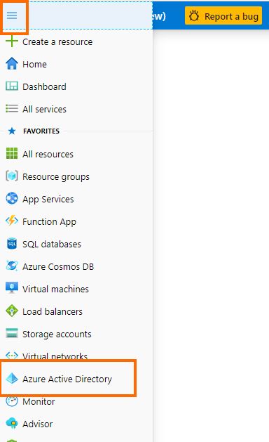
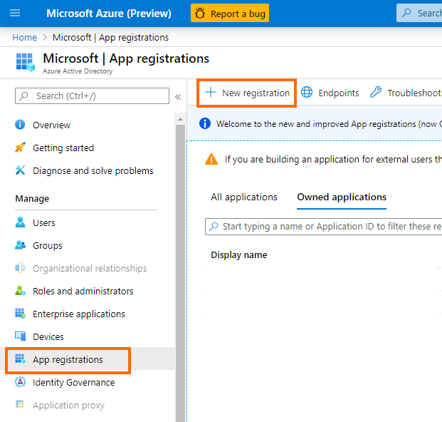
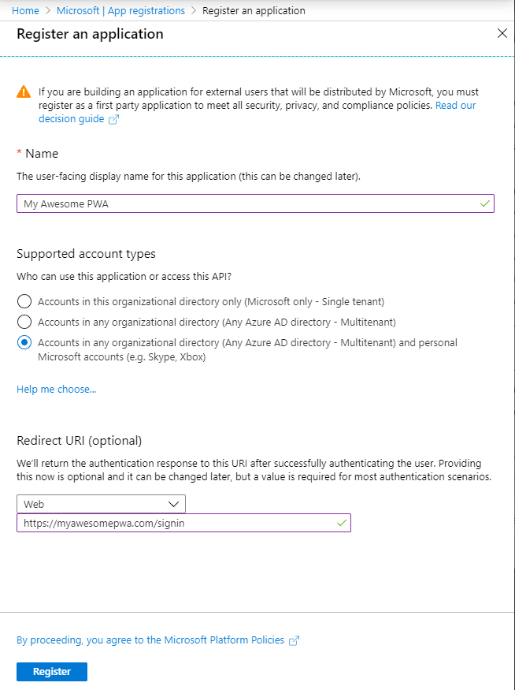
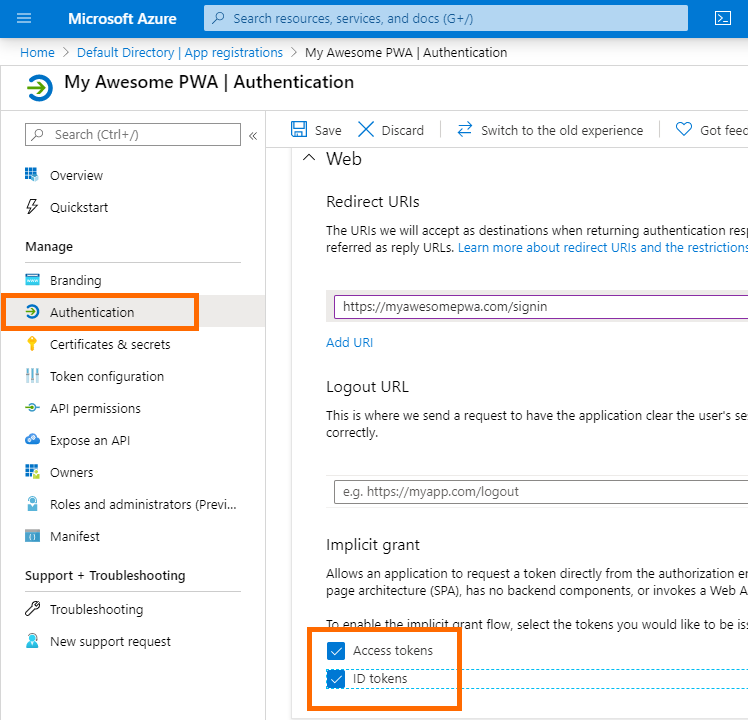
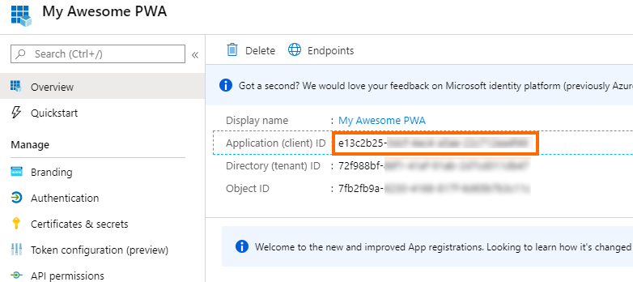

# Creating a Microsoft key

To let your users sign-in with their Microsoft account, you'll need to create a Microsoft key. This walk-through shows how to do that. You may also refer to Microsoft's documentation: [Adding sign in with Microsoft](https://developer.microsoft.com/en-us/identity/add-sign-in-with-microsoft).

In short, we want to create an App Registration in Azure Active Directory, which will give us the key.

## Step 1: Login to <a href="https://portal.azure.com">Azure Portal</a>

If you don't yet have an Azure account, [create a free account](https://azure.microsoft.com/en-us/free/).

Once you have an Azure account, login to [portal.azure.com](https://portal.azure.com).

## Step 2: Go to Azure Active Directory

From the hamburger menu, choose `Azure Active Directory`.



## Step 3: Create a new app registration

In the Azure Active Directory pane on the left, choose `App registrations`, then click `+ New Registration`.



## Step 4: Configure your app

Azure will ask you for `app name`, `supported Microsoft account types`, and `redirect URI`. 

- `Name`: This is the name your users will see when prompted to sign-in with their Microsoft account, e.g. "Sign in My Awesome PWA" 
- `Supported account types`: What types of Microsoft accounts can sign in? Here you can limit the kinds of Microsoft accounts that will be able to sign-in, whether MS accounts tied to your corporation/organization, any business or educational Microsoft account, or any Microsoft account. For broadest support, use the last option.
- `Redirect URI`: Where the Microsoft authentication flow will return the authentication response. You should choose `Web` for the type and your app URL for the URL. You may add multiple URLs (including localhost for testing) after registration.

Click `Register` to finalize your app registration.



## Step 5: Enable access tokens

To allow your key to request a token directly, you need to enable implicit grant flow:

Click `Authentication` from the nav menu on the left, then check the `Access token` and `ID tokens` checkboxes:



Click `Save` to finish.

## Step 6: Copy your key

Your key is generated, listed as "Application (client) ID":



Copy that key and paste it into your `<pwa-auth>` component:

```html
<pwa-auth microsoftkey="abc123"></pwa-auth>
```

You're done - you now have a working Microsoft key, allowing users to sign-in with their Microsoft accounts. 😎

## Additional notes about the Microsoft sign-in provider

### Microsoft Authentication Library (MSAL)
pwa-auth uses <a href="https://docs.microsoft.com/en-us/azure/active-directory/develop/msal-overview">Microsoft Authentication Library (msal.js)</a> to sign-in and get authentication tokens.

To keep pwa-auth lightweight, msal.js is lazy-loaded when the user clicks "Sign in with Microsoft". Thus, no JS loading or parsing overhead is incurred if the user doesn't try to sign-in with his Microsoft account.

### Access Tokens

During sign-in, pwa-auth acquires an access token and requests the user's profile picture.

This access token will be returned to you during the `signin-completed` event:

```javascript
const pwaAuth = document.querySelector("pwa-auth");
pwaAuth.addEventListener("signin-completed", e => {
    if (e.detail.providerData) {
        const accessToken = e.detail.providerData.accessToken;

        // Use the access token to do things with Microsoft Graph
        // ... 
    }
});
```

This access token can then be used to interact with the Microsoft Graph, for example, access the user's profile information, interact with the user's OneDrive, Outlook calendar and inbox, interact with the user's Microsoft Teams account, and so on. See details over at <a href="https://developer.microsoft.com/en-us/graph/graph-explorer#">Microsoft Graph Explorer</a>.

### Raw `providerData` with Microsoft Sign-In
When a user signs-in with their Microsoft account, pwa-auth will fire the `signin-completed` event with the usual data -- `email`, `name`, `imageUrl` -- as well as Microsoft-specific sign-in data via `providerData`. The `providerData` will look something like this:

```json
{
    "uniqueId": "abc123",
    "tenantId": "abc123",
    "tokenType": "id_token",
    "idToken": {
        "rawIdToken": "abc123abc123",
        "claims": {
            "aud": "abc123",
            "iss": "https://login.microsoftonline.com/abc123/v2.0",
            "iat": 1585679012,
            "nbf": 1585679012,
            "exp": 1585682912,
            "aio": "abc123=",
            "name": "John Doe",
            "nonce": "abc-123",
            "oid": "abc-123",
            "preferred_username": "johndoe@outlook.com",
            "rh": "I",
            "sub": "abc123",
            "tid": "abc123",
            "uti": "d_abc-123",
            "ver": "2.0"
        },
        "issuer": "https://login.microsoftonline.com/72f988bf-86f1-41af-91ab-2d7cd011db47/v2.0",
        "objectId": "d39b1172-cce3-475f-a2c5-b19d5f2604ed",
        "subject": "G6P62csn01gy318jlRl66xb3T0qyoa3ZyeB9F8ursvI",
        "tenantId": "72f988bf-86f1-41af-91ab-2d7cd011db47",
        "version": "2.0",
        "preferredName": "juhimang@microsoft.com",
        "name": "Judah Himango",
        "nonce": "77bf5dbb-a9be-4fb0-aeda-34033f3741e8",
        "expiration": 1585682912
    },
    "idTokenClaims": {
        "aud": "abc123",
        "iss": "https://login.microsoftonline.com/abc123/v2.0",
        "iat": 1585679012,
        "nbf": 1585679012,
        "exp": 1585682912,
        "aio": "abc123=",
        "name": "John Doe",
        "nonce": "abc123",
        "oid": "abc123",
        "preferred_username": "johndoe@outlook.com",
        "rh": "I",
        "sub": "abc123",
        "tid": "abc123",
        "uti": "d_abc-123",
        "ver": "2.0"
    },
    "accessToken": "abc123abc123",
    "scopes": [],
    "expiresOn": "2020-03-31T19:28:32.000Z",
    "account": {
        "accountIdentifier": "abc-123",
        "homeAccountIdentifier": "abc123",
        "userName": "johndoe@outlook.com",
        "name": "John Doe",
        "idToken": {
            "aud": "abc123",
            "iss": "https://login.microsoftonline.com/abc123/v2.0",
            "iat": 1585679012,
            "nbf": 1585679012,
            "exp": 1585682912,
            "aio": "abc123=",
            "name": "John Doe",
            "nonce": "abc123",
            "oid": "abc123",
            "preferred_username": "johndoe@outlook.com",
            "rh": "I",
            "sub": "abc123",
            "tid": "abc123",
            "uti": "d_abc-123",
            "ver": "2.0"
        },
        "idTokenClaims": {
            "aud": "abc123",
            "iss": "https://login.microsoftonline.com/abc123/v2.0",
            "iat": 1585679012,
            "nbf": 1585679012,
            "exp": 1585682912,
            "aio": "abc123=",
            "name": "John Doe",
            "nonce": "abc123",
            "oid": "abc123",
            "preferred_username": "johndoe@outlook.com",
            "rh": "I",
            "sub": "abc123",
            "tid": "abc123",
            "uti": "d_abc123",
            "ver": "2.0"
        },
        "environment": "https://login.microsoftonline.com/abc123/v2.0"
    },
    "accountState": "abc123",
    "fromCache": false
}
```


### Photo URL is supported for work and school accounts only

When the user signs in, pwa-auth dispatches the `signin-completed` event with the user's image URL:

```javascript
const pwaAuth = document.querySelector("pwa-auth");
pwaAuth.addEventListener("signin-completed", e => {
    const imgUrl = e.detail.imageUrl;
    
    // Do something with the user's profile pic
    // ...
});
```

Note that this image URL will be null for personal Microsoft accounts. Microsoft Graph 1.0 supports fetching profile pictures only for work and school accounts. See [Microsoft Graph Get Photo documentation](https://docs.microsoft.com/en-us/graph/api/profilephoto-get?view=graph-rest-1.0) for more information.


### Photo URL will be a base64-encoded image URL

In the `signin-completed` event, `imageUrl` be a base64 encoded image URL. This is necessary because Microsoft accounts do not have publicly-available profile image URLs. pwa-auth converts the raw image to a base64 encoded image URL before dispatching the event.