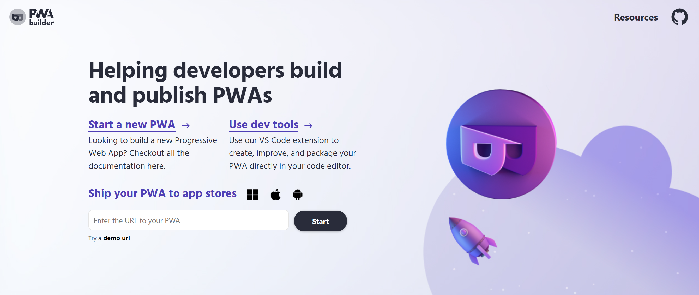

# PWABuilder Suite Documentation

Welcome to the new documentation for the PWABuilder tooling suite! 

The suite has three main tools:

   <sl-card class="home-nav-card">
         <h3>
            PWA Starter
         </h3>
         <body>
           Build a new progressive app with the development-ready PWA Starter.
         </body>
      <sl-button href="#/starter/quick-start">Go to Starter Docs</sl-button>
   </sl-card>
   <sl-card class="home-nav-card">
         <h3>
            PWABuilder
         </h3>
         <body>
         Package progressive web apps for native app stores with PWABuilder.
         </body>
      <sl-button href="#/builder/quick-start">Go to Builder Docs</sl-button>
   </sl-card>
   
   <sl-card class="home-nav-card">
         <h3>
            PWABuilder Studio
         </h3>
         <body>
            Ease PWA development with the PWABuilder Studio VS Code extension.
         </body>
      <sl-button href="#/studio/quick-start">Go to Studio Docs</sl-button>
   </sl-card>

If you'd like a more in-depth overview of each tool, continue reading below.

!> Never worked with progressive web apps before? Jump right into our [***Introduction to Progressive Web Apps***](/home/pwa-intro)

## PWA Starter 

The PWA Starter is our opinionated and production tested starter that the PWABuilder team uses to build all of our PWAs, including PWABuilder itself. 

The PWA Starter uses a lightweight, fast, and extensible stack that allows you to quickly get started with developing a new PWA. 

It comes with the key pieces of any PWA, including a manifest and service worker functionality through [Workbox.](https://developers.google.com/web/tools/workbox/)

To learn more about the starter's tech stack and how to develop on it, take a look at the [quick start.](/starter/quick-start)

## PWABuilder Studio

PWABuilder Studio is an extension for Visual Studio Code that provides tooling for working with and creating progressive web apps.

You can use PWABuilder Studio to:

* Create a new PWA using the starter template
  
* Convert an existing web app into a PWA
  
* Manage your app’s manifest, service workers, and icons
  
* Package your apps for the Microsoft, Google, and Apple Stores
  
* Validate your PWA across several metrics
  
* Add web capabilities with code snippets

To learn more about PWABuilder Studio, take a look at the [quick start.](/studio/quick-start)

## PWABuilder

[PWABuilder.com](https://www.pwabuilder.com/) is the hallmark tool within the PWABuilder suite. 

PWABuilder enables developers to quickly and easily to generate store uploadable packages for the Microsoft, Google Play, and iOS App stores. 

In addition to store-ready packages, you can also generate side-loadable packages for testing and validation.

To learn more about packaging with PWABuilder, take a look at the [quick start.](/builder/quick-start)

   

