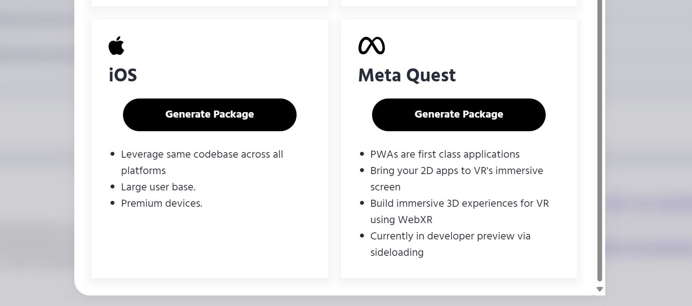

# Packaging PWAs for Meta Quest

PWABuilder’s support for Meta Quest utilizes the [CLI tool published by Meta](https://developer.oculus.com/documentation/web/pwa-packaging/) to generate an apk package that can be installed on a Meta Quest.

## Prerequisites

We strongly recommend reading Meta's documentation on PWAs:
- [Overview of PWA support on Meta Quest](https://developer.oculus.com/pwa/)

You will need: 
* A valid PWA with a web manifest, published to the web and secured through HTTPS
* A Meta Quest for sideloading and testing
* An Oculus Developer Account and Device Setup (follow instructions [here](https://developer.oculus.com/documentation/native/android/mobile-device-setup/))

## Packaging

The first step is to generate your .apk package with PWABuilder.

1. Navigate to [pwabuilder.com](https://pwabuilder.com).
   
2. Enter the URL of your PWA on the homepage.

<div class="docs-image">
     
</div>

3. Click `Package for stores` in the upper right to navigate to the package selection page.
   
4. Click on `Generate Package` in the Meta Quest section.

<div class="docs-image">
    
</div>

5. Customize your package options - these are covered in more detail below.
   
6. Click `Download Package`.

#### Saving Your Signing Key

Your zip file contains ```signing.keystore``` and ```signing-key-info.txt```. ```signing.keystore``` is the key store file containing the signing key.
```signing-key-info.txt``` is a text file containing your signing key information, such as the key password, store password, and key alias.
Keep both of these files in a safe place. You’ll need them to deploy future versions of your app. 


## Configuration Options

Here's a breakdown of the properties associated with your package:

| Property | Description                                                                                                                                                              |
| :------------------------------------------------------------------------|-------------------------------------------------------------------------------------------------------- |
|**Package ID** | The ID of your Meta Quest app. We recommend a reverse-domain style string: com.domainname.appname. Letters, numbers, periods, hyphens, and underscores are allowed. |
|**App name** | The name of your app as displayed to users.                                                                                                                           |
|**App version** | This is the version string displayed to end users, e.g. “1.0.0.0”                                                                                                  |
|**App version code**| This is an integer used as a private, internal version of your app.                                                                                           |
|**Manifest URL** | The URL of your app manifest. We prepopulate this for you.                                                                                                        |
|**Signing key**| How the APK app package will be digitally signed: <br><br> `None`: your app package won’t signed. <br><br> `New`: PWABuilder will create a new signing key for you. The signing key will be included in your zip download. Choosing this will let you fill in details like password, alias, and more. <br><br> `Mine`: Upload an existing .keystore file to use for signing the app package. This should be used if you are updating an existing app. You’ll be prompted to specify your existing key passwords and alias.                                                         |


## Sideloading and Testing

In order to test your PWA, you'll need:

- A Meta Quest device
  
- A USB-C cable to connect your Meta Quest device to your PC or Mac.
  
- Verify your Quest software is up-to-date. Turn on your Quest device and open `Settings` -> `System` -> `Software Update`.  Your software version should be 31 or greater.
  
- Make sure your device is setup and your developer account is enabled according to the documentation [here](https://developer.oculus.com/documentation/native/android/mobile-device-setup/).


Once you have checked off all the prerequisites, follow the instructions [here](https://developer.oculus.com/documentation/web/pwa-packaging/#sideload-your-pwa-to-test) to sideload and test your app on your Meta Quest!

## Next Steps

Progressive web apps are cross-platform and can be used anywhere! 

After you've sucessfully packaged your app for Meta Quest, you can package and publish for other platforms:

- [How to Package for the App Store](/builder/app-store)

- [How to Package for Microsoft Store](/builder/windows)

- [How to Package for the Google Play Store](/builder/android)