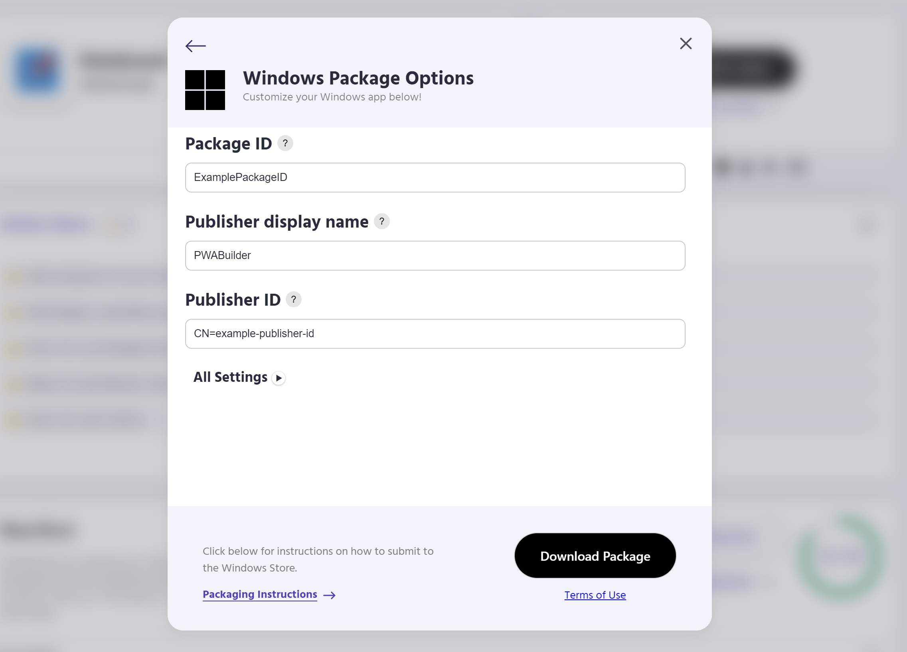

# Quick Start
    
PWABuilder is an open source tool that allows developers to package their PWAs for publishing to various stores, including Microsoft, Google Play, and the iOS App Store. 

## Prerequisites

If your web app meets a few baseline PWA requirements, you can use PWABuilder to validate, score, and package your application for stores.

Your PWA needs to:

* be published at a public URL
* have a complete web manifest
* be secured with HTTPS

If your app meets these requirements, you can package with PWABuilder.

?> **Note** To publish your package, you will need a Developer Account with each platform you want to publish with. 
For the Microsoft and Google Play stores, these cost a one time fee of $19 and $25, respectively. For the Apple App Store, 
an account costs a recurring $99 per year.

## Packaging
You can have an application package for your PWA in just a few steps:

1. From the  [homepage of PWABuilder](https://www.pwabuilder.com/), you can enter a URL to start the packaging process.

     

2. PWABuilder will then score your PWA and display the results.

     

3. Click `Next`.

4. Select the platform you would like to download a package for.

5. Enter metadata for your application and click `Generate`.

6. Now, download your package! That's it!

     

## Next Steps 

If you're looking for more specific guidance on how to publish a PWA to a specific store, check out the platform-specific articles:

**[iOS App Store]()**

**[Microsoft Store]()**

**[Google Play Store]()**